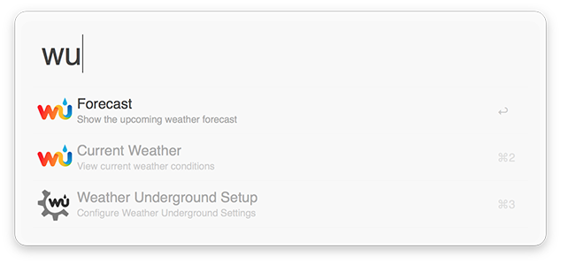
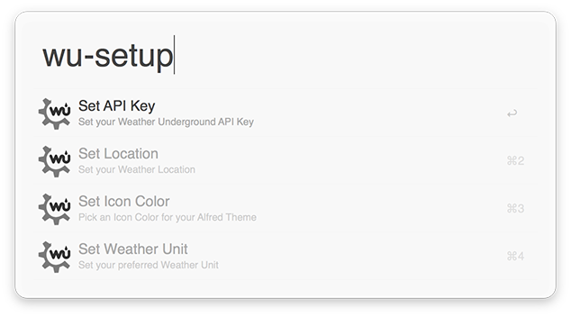
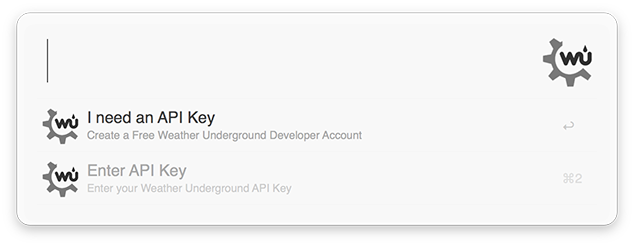
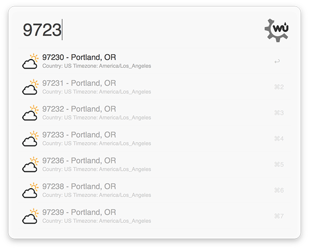
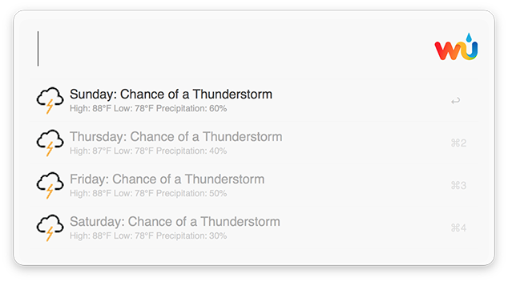
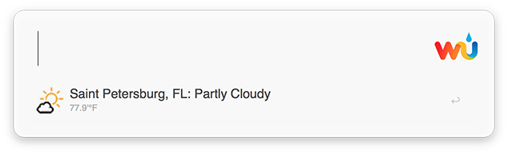

Weather Underground Alfred Workflow ( [Download v1.0](https://raw.githubusercontent.com/manifestinteractive/weather-underground-alfred-workflow/master/WeatherUnderground.alfredworkflow) )
===

Alfred App Workflow for [Weather Underground](https://www.wunderground.com/)

Requirements
--- 

1. [Alfred App v2+](http://www.alfredapp.com/#download)
2. [Alfred Powerpack](https://buy.alfredapp.com/)

Installing
---

1. Click the download buttons below
2. Double-click to import into Alfred
3. Run `wp-setup` and configure each of the 4 options

Commands
---

* `wu-setup api` ( **REQUIRED**: Provide your Weather Underground API Key )
* `wu-setup location` ( **REQUIRED**: Provide your City or Zipcode )
* `wu-setup icon` ( OPTIONAL: Choose whether you want Black or White icons )
* `wu-setup unit` ( OPTIONAL: Choose whether you want Fahrenheit or Celsius )

### Get API Key:

[https://www.wunderground.com/weather/api](https://www.wunderground.com/weather/api)

### Getting Weather:

**NOTE**: Weather Underground API Searches are Cached for 5 minutes.

* `wu current` ( Fetch current weather for your location )
* `wu forecast` ( Fetch 3 day forecast for your location )

Screenshots
---

